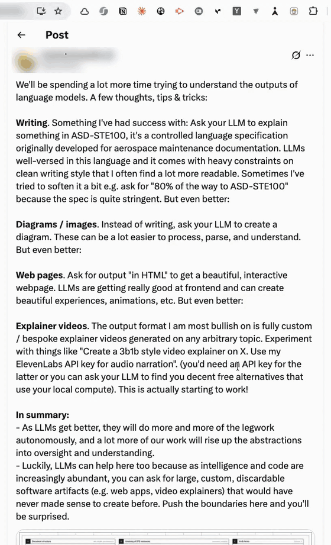
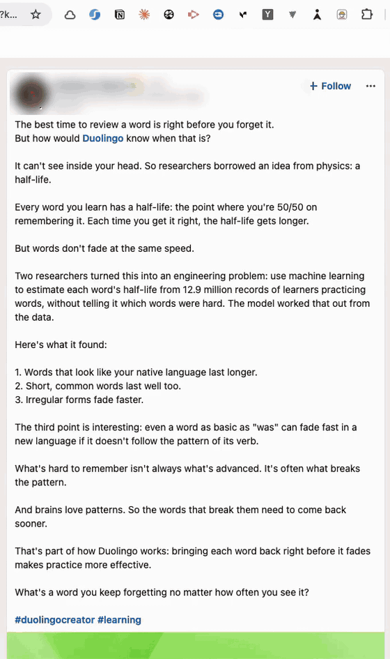

# Deslop

A Chrome extension that removes the slop from whatever you are reading. Click the toolbar button, click a post or paragraph, and a small construction worker walks a plank above the text, fires a cannon at each piece of filler, and rolls the plain version into the gap. A message at the top gives the word count before and after, with an Undo.

The change is on your screen only. Nothing is posted or sent to the site.



Cut to the bone on a LinkedIn post, 226 words down to 114:



Both clips are screen recordings of the extension in Chrome at real speed, cropped to the toolbar and the post. The authors are blurred.

## Install

1. Clone this repository.
2. Start the server with your Anthropic API key. It needs Node 18 or later and has no dependencies.

   ```
   ANTHROPIC_API_KEY=sk-ant-... node server/server.js
   ```

3. Open `chrome://extensions`, turn on **Developer mode**, press **Load unpacked** and choose the repository folder.
4. Pin the hard-hat icon to the toolbar.

The server listens on `http://localhost:5055`. The extension holds no API key. It sends the text of the block you clicked to the server on your machine, and the server sends it to Claude. Set `DESLOP_MODEL` to use a different Claude model, and `PORT` to move the server (then change `SERVER` in `bg.js` and `host_permissions` in `manifest.json` to match).

## Use

- Click the icon or press Alt+Shift+D. Hover a post: the block that will be cleaned gets a dashed red outline. Click it and a wheel opens where you clicked.
- Esc while picking cancels. Esc while the animation runs skips to the result.
- **Undo** in the message at the top puts the original text back. Reloading the page also does.

Only the words of a post are touched. On X and LinkedIn the picker takes the post's text block wherever you click on the post. Elsewhere it drills down to the block that holds most of the text, so author lines and buttons stay.

## The wheel

- **Worker, Ninja, Chomper, Crane.** Click one and it starts.
  - Worker: walks a plank, fires a cannon, repaints with a roller in red that dries to the text colour.
  - Ninja: drops in on a bamboo pole in a puff of smoke, throws spinning nunchucks that slice the phrase and fly back to his hand, repaints with a brush in black ink.
  - Chomper: a round mouth that leaves the plank, runs along each flagged phrase eating it word by word, then runs the line again while the new words pop out behind it.
  - Crane: a trolley on a girder swings a wrecking ball through each phrase, then lowers the new words in line by line on a hook.
- **Strength.** Each click steps Gentle, Firm, Ruthless, To the bone. The wheel stays open.
  1. Gentle: only the obvious. Announcing lines, engagement bait, hashtag stacks, emoji bullets.
  2. Firm: the full slop list. Sentences that are fine are left alone.
  3. Ruthless: a sentence stays only if it carries a fact, number, decision or specific claim. Aims for half the length.
  4. To the bone: what happened and what is claimed, in the fewest words. Aims for a third.
- **Bin.** On or off. When on and more than 60% of the words are slop at the chosen strength, the post turns into a sheet of paper, is torn in two, crumpled and thrown into a bin, and is written again from scratch.
- **The hub** in the middle runs it with the last style used.

Choices are remembered. A long list of cuts speeds the animation up, so a ruthless pass does not run for minutes.

## What counts as slop

- Announcing and throat-clearing: "I'm thrilled to share", "Here's the thing", "In today's fast-paced world".
- Engagement bait: hook lines that withhold the point, closers like "Agree?", "Thoughts?", "Let that sink in."
- Constructions used for drama: "It's not X, it's Y", triads for rhythm, one-line paragraphs for effect, a question answered in the next sentence.
- Hollow words: intensifiers, corporate jargon, vague abstractions where a plain word exists.
- Padding: sentences that restate the previous one, wordy phrases, stacked hashtags, emoji used as bullets.

The author's facts, names and numbers are kept. Paragraph labels such as "Step 2:" are treated as structure and left in place. The full instructions are in `server/server.js`.

## How it works

- `bg.js`: the toolbar button injects `content.css` and `content.js` into the current tab. It also relays the text to the server's `POST /api/deslop`, because an https page cannot call localhost itself.
- `content.js`: the picker, the wheel, the text mapping and the animation. The worker, cannon and projectiles live in a shadow root so the page's styles cannot touch them. The page's own text is changed only by wrapping the flagged phrases and swapping in the replacements. Everything is built node by node with no `innerHTML`, since some sites restrict it.
- `server/server.js`: asks Claude for `{edits: [{quote, fix}]}`, exact phrases and what replaces each, or "" to cut. It keeps only the edits whose quote it can find in the text, and returns the share of words that are slop plus a from-scratch rewrite when that share passes 60%.
- The text sent is the visible text of the block you clicked, up to 12,000 characters.

## Try it without installing

Open `test/post.html` and press "Run without the extension". It plays the animation on a sample post with a fixed rewrite, so it needs neither the extension nor the server.

## Limits

- Checked on one long post on X and one on LinkedIn in Chrome, on 2 October 2026. Both sites change their markup often. When the site-specific selectors miss, the picker falls back to the nearest block of text under the pointer.
- Sites that re-render their text (React apps do this when you interact with a post) may put the original text back.
- A rewrite takes 5 to 30 seconds depending on length and strength. The worker keeps reading until it arrives.
- A cut line can leave an extra blank line or a stray leading space behind.
- `server/server.js` shares its prompt and matching code with the private backend the recordings used, but has not yet been run against the API with a key.
